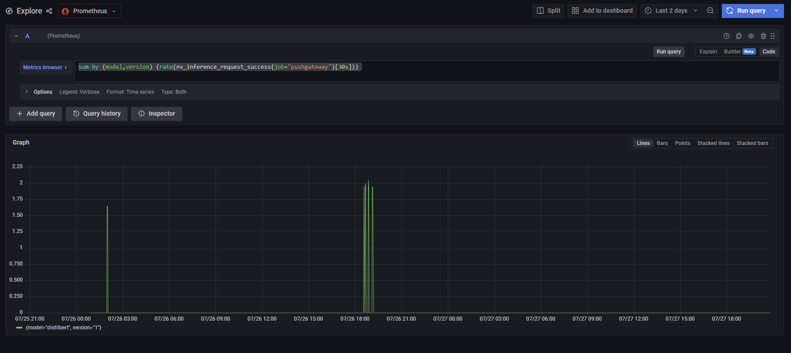
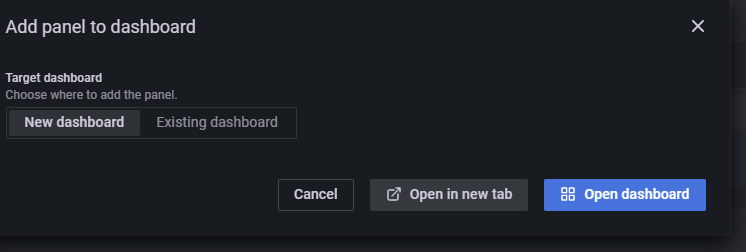
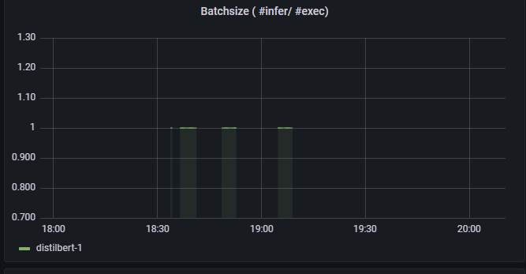
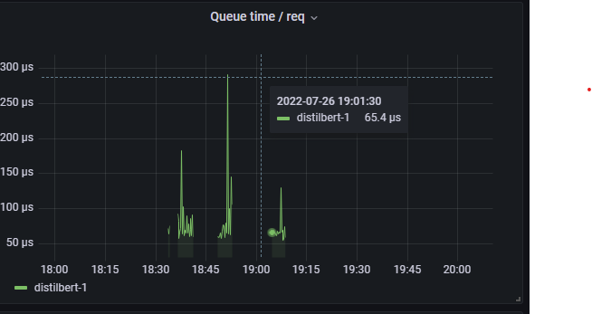
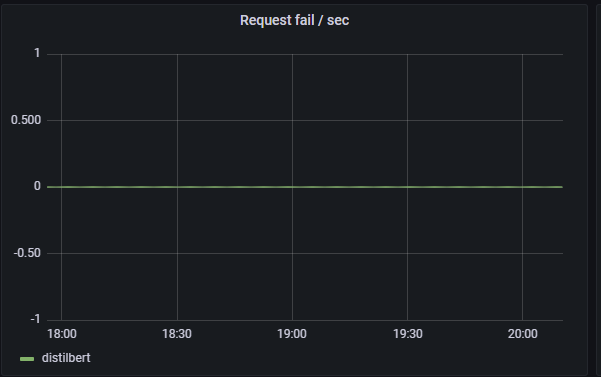
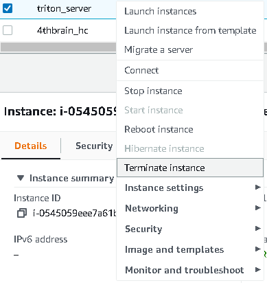

# <h1 align="center" id="heading">Monitoring Sentiment Analysis on Nvidia Triton with Prometheus and Grafana on EC2</h1>


## ☑️ Objectives
At the end of this session, you will have a brief understanding of how to:
- [ ] Trace an ML model with torchscript
- [ ] Create a model repository
- [ ] Deploy the models in the repository using Nvidia Triton server
- [ ] Deploy Grafana and Prometheus
- [ ] Create a Grafana dashboard to monitor Nvidia Triton Server


# Nvidia Triton Server

This project contains the source code and supporting files to deploy a triton inference server on an AWS EC2 instance. It includes the following files and folders.

- TorchscriptTracing.ipynb - Notebook to trace a huggingface model into a format compatible with triton server
- inference.py - Code to perform requests to the triton server
- requirements.txt - A list of the required libraries to install

The application uses several AWS resources, including EC2 instances functions and an S3 bucket for the model repository.

<details>
     <summary><b>Before we Get Started</b></summary>    


## I. Dependencies

To complete the assignment you need to feel confortable using ssh to remotely access an AWS EC2 instance. Docker must be installed on the instance.

### I.1 AWS account creation

Follow the next tutorial to create and verify an AWS account

<https://aws.amazon.com/premiumsupport/knowledge-center/create-and-activate-aws-account/>

### I.2 Docker installation

Use the convenience script to install docker on linux. For more

**Note: The teslabot represents the machine we're running on and the $ stands for the console indicator right before any shell commands you type appear. All the dollar sign is signifying is that what comes after is meant to be run on the command line (it is not actually a part of the command).**

```bash
 teslabot$ curl -fsSL <https://get.docker.com> -o get-docker.sh
 teslabot$ DRY_RUN=1 sh ./get-docker.sh
```

Verify that your user can run docker commandas ccan run Docker commands without using sudo.by
running by running the following command:

```bash
 teslabot$ docker ps

 CONTAINER ID        IMAGE               COMMAND             CREATED             STATUS              PORTS               NAMES

```

### I.3 Install the requirements locally to trace the model and run the inference

Install the required libraries using pip

```bash
teslabot$ pip install -r requirements.txt
```

</details>


<details>
     <summary><b>Run the jupyter notebook to get the torchscript model</b></summary>


## II. Use the TorchscriptTracing notebook to create a compatible model

To create a model compatible with Nvidia Triton server, you must run inference once with the jit compiler


You should see a model.pt created and you need to create a config.pbtxt that contains the input and output tensor shapes:

```bash
name: "distilbert"
platform: "pytorch_libtorch"
input [
 {
    name: "input__0"
    data_type: TYPE_INT32
    dims: [1, 256]
 }
]
output {
    name: "output__0"
    data_type: TYPE_FP32
    dims: [1, 2]
  }

```

In this case, the input tensors are tokenised sentences 256 words long and the outputs are the logits for the negative/positive classes.

</details>


<details>
     <summary><b>Deploy on AWS</b></summary>

## III. Deploy on AWS

### III.1 Create an S3 model repository and launch an EC2 Instance

1. Make sure that you have an active AWS account

2. Select us-west-1 as the aws region for the remaining steps of the assignment.
  

3. Go to [S3 storage](https://s3.console.aws.amazon.com/s3/home?region=us-west-1)
create a new bucket clicking "Create Bucket"

4. Upload the traced model with the following folder structure:
```bash
    models
    └───distilbert
        └───config.pbtxt
        └───1
            └───model.pt
```


5. Go to [EC2 instances](https://us-west-1.console.aws.amazon.com/ec2/v2/home?region=us-west-1#Home:)
launch a new instance clicking "Launch Instance"


6. SSH into the EC2 instance
```bash
teslabot$ ssh -i triton-key.pem ec2-user@ec2.public.ipv4.address
```

### III.2 Deploying with Nvidia Triton server

Create a env file with aws credentials in the ec2 server:

    AWS_ACCESS_KEY_ID=SOME_ACCESS_KEY
    AWS_SECRET_ACCESS_KEY=SOME_SECRET_ACCESS_KEY
    AWS_DEFAULT_REGION=us-east-1

To run the inference server on GPU:

```bash
teslabot$ docker run --gpus=1 -p8000:8000 -p8001:8001 -p8002:8002 --env-file .envs3 -p8000:8000 -p8001:8001 -p8002:8002 --rm --net=host nvcr.io/nvidia/tritonserver:22.06-py3 tritonserver --model-repository=s3://triton-repository/models/
```

To run the inference server on CPU:

```bash
teslabot$ docker run -p8000:8000 -p8001:8001 -p8002:8002 --env-file .envs3 -p8000:8000 -p8001:8001 -p8002:8002 --rm --net=host nvcr.io/nvidia/tritonserver:22.06-py3 tritonserver --model-repository=s3://triton-repository/models/
```


### III.3 Testing the API endpoint

Modify the inference.py file to the EC2 instance IP:


Run the inference client

```bash
teslabot$ python3 inference.py
```

</details>


### Resources

See the [PyTorch Torchscript Documentation](https://pytorch.org/docs/stable/jit.html) for more details on torchscript

See the [Nvidia Triton Documentation](https://docs.nvidia.com/deeplearning/triton-inference-server/user-guide/index.html) for more details on the deployment
# Prometheus and Grafana

This part contains the instructions  and supporting resources to deploy Prometheus and Grafana on an AWS EC2 instance and create a monitoring dashboard for Nvidia's Triton Server.

<details>
     <summary><b>Before we Get Started</b></summary>    

## 1 Prerequisites

a. EC2 instance

b. ports 9090 and 3000 exposed to the internet

c. Docker

d. docker-compose

e. multiple inference requests executed on triton server

### Docker-compose

Depending on your envirmenemt, docker-compose might be not installed. To install . Please check the installation method for your

- on Amazon EC2 Linux

```bash
sudo curl -L https://github.com/docker/compose/releases/latest/download/docker-compose-$(uname -s)-$(uname -m) -o /usr/local/bin/docker-compose

sudo chmod +x /usr/local/bin/docker-compose

docker-compose version
```

- On any other OS or linux distribution:
[Installation guide
](https://docs.docker.com/compose/install/)

     </details>


<details>
     <summary><b>Installing grafana and prometheus</b></summary>    

## 2. Installing grafana and prometheus

- Clone this repository on your workspace

<https://github.com/Einsteinish/Docker-Compose-Prometheus-and-Grafana>

- Create a .env file inside the repository to set the following variables:

```bash
ADMIN_USER=admin  
ADMIN_PASSWORD=admin
```

Execute the following commands to run the stack

```bash
cd Docker-Compose-Prometheus-and-Grafana
docker-compose up -d

```

- Navigate to http://\<host-ip\>:3000 and login with user admin password admin. You can change the credentials in the compose file or by supplying the ADMIN_USER and ADMIN_PASSWORD environment variables via .env file on compose up.

Grafana is preconfigured with dashboards and Prometheus as the default data source:

Name: Prometheus
Type: Prometheus
Url: <http://prometheus:9090>
Access: proxy

This grafana configuration comes with a docker Docker Host Dashboard

\

It shows key metrics for monitoring the resource usage of your server:

- Server uptime, CPU idle percent, number of CPU cores, available memory, swap and storage
- System load average graph, running and blocked by IO processes graph, interrupts graph
- CPU usage graph by mode (guest, idle, iowait, irq, nice, softirq, steal, system, user)
- Memory usage graph by distribution (used, free, buffers, cached)
- IO usage graph (read Bps, read Bps and IO time)
- Network usage graph by device (inbound Bps, Outbound Bps)
- Swap usage and activity graphs

To access the Docker Host Dashboard, click on "f" on your keyboard while being on Grafana, then search for and click on "Docker Host".

For more information on how to navigate Grafana, check this <https://grafana.com/docs/grafana/next/dashboards/use-dashboards/>

</details>


<details>
     <summary><b>Triton Server Monitoring</b></summary>    

## 3. triton server monitoring

### 3.1 exposing metrics

Triton provides Prometheus metrics indicating GPU and request statistics. By default, these metrics are available at http://\<host\>:8002/metrics. The metrics are only available by accessing the endpoint, and are not pushed or published to any remote server. The metric format is plain text so you can view them directly, for example:

```curl <host>:8002/metrics```

### 3.2 Collecting metrics

* Modify the prometheus configuration located in prometheus/prometheus.yml
 to collect triton server metrics .
 A scrape_config section specifies a set of targets and parameters describing how to scrape them. In the general case, one scrape configuration specifies a single job. In advanced configurations, this may change.
Targets may be statically configured via the static_configs parameter or dynamically discovered using one of the supported service-discovery mechanisms.

* Create a new scraping job and use static config with the metrics hosts.

* Reload your docker compose stack to take advantage of the recent changes.
*  Head to prometheus UI and check whether you are pulling data.
* Play around with Triton servers metrics
<https://github.com/triton-inference-server/server/blob/main/docs/metrics.md>


### 3.3 Building a dashboard

Head to Grafana's explore page (you can find it on the left sidebar).
Inside the metrics browser, write this query :

```python
sum by (model,version) (rate(nv_inference_request_success[30s]))
```

This will shows the number of successful requests by every passing second.

Change the time window to match the time when you were doing model inferring with triton server, then click on run query. You should be able to see



On the top right, click on "Add to dashboard", and then on "Open dashboard". This will create a new dashboard containing a panel that uses the query we definded earlier.




Click on Ctrl + S  to save the dashboard.

Congrats ! you just created your first Grafana panel and dashboard

</details>

<details>
     <summary><b>Adding more Panels</b></summary>    

## 4. Adding more panels

### 4.1 Prometheus quering

In order to build new panels, we need a good understaning of querying with prometheus (PromQL)

<https://prometheus.io/docs/prometheus/latest/querying/basics/>

Let's check some examples

<https://prometheus.io/docs/prometheus/latest/querying/examples/>

### 4.2 More panels = more fun

The goal of this part of the assignement is to create new 4 panels:

**a. Cumulative Inference Requests:**
The cumulative number of inference requests succcess and failures by time.


**b. Batch size :**
the ratio of the number of inference requests on the execution numbers by time.



**c. Queue time by requst:**
the ratio of queue time/request.



**d. Request failure by Second:**
Number of failed requests by second



</details>


## Cleanup

To delete Grafana and prometheus, head to the repository and run :

```bash
docker-compose down
```

To delete the sample application that you created, just terminate the EC2 instance by right clicking it and selecting "Terminate Instance":


